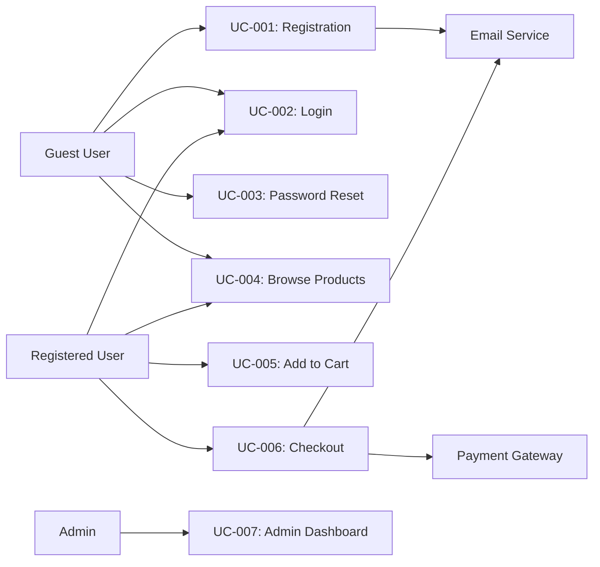

# Use Case Diagram

## Metadata
- **Version**: 1.0
- **Author**: Business Analyst
- **Date**: YYYY-MM-DD
- **Project**: [Project Name]

## System Overview

**System Name**: [Application Name]
**Description**: [Brief description of the system]

## Actors

### Primary Actors

| Actor ID | Actor Name | Description |
|----------|-----------|-------------|
| A1 | Guest User | Unauthenticated visitor browsing the site |
| A2 | Registered User | Authenticated user with account |
| A3 | Admin | System administrator with elevated privileges |
| A4 | Payment Gateway | External payment processing system |

### Secondary Actors

| Actor ID | Actor Name | Description |
|----------|-----------|-------------|
| A5 | Email Service | External email sending service |
| A6 | Analytics Service | External analytics tracking service |

## Use Cases

### UC-001: User Registration

**Actor**: Guest User (A1)
**Description**: User creates a new account

**Preconditions**:
- User is on the registration page
- User has valid email address

**Postconditions**:
- User account is created
- Welcome email is sent
- User is logged in

**Basic Flow**:
1. User navigates to registration page
2. User enters email, password, and name
3. User accepts terms of service
4. User clicks "Register"
5. System validates input
6. System creates user account
7. System sends welcome email
8. System logs user in
9. User is redirected to dashboard

**Alternative Flows**:
- A1: Invalid email format
  - System displays error message
  - User corrects email and retries

- A2: Email already registered
  - System displays error message
  - User is prompted to login or reset password

**Exception Flows**:
- E1: Email service unavailable
  - Account is created but email not sent
  - System logs error
  - User can request email resend

**Priority**: High
**Complexity**: Medium

---

### UC-002: User Login

**Actor**: Guest User (A1), Registered User (A2)
**Description**: User authenticates with credentials

**Preconditions**:
- User has registered account
- User is on login page

**Postconditions**:
- User is authenticated
- Session is created
- User is redirected to dashboard

**Basic Flow**:
1. User navigates to login page
2. User enters email and password
3. User clicks "Login"
4. System validates credentials
5. System creates session
6. User is redirected to dashboard

**Alternative Flows**:
- A1: Invalid credentials
  - System displays error message
  - User can retry or reset password

- A2: Account locked
  - System displays lockout message
  - User is prompted to contact support

**Exception Flows**:
- E1: Too many failed attempts
  - Account is temporarily locked
  - System sends security alert email

**Priority**: High
**Complexity**: Low

---

### UC-003: Password Reset

**Actor**: Guest User (A1)
**Description**: User resets forgotten password

**Preconditions**:
- User has registered account
- User is on forgot password page

**Postconditions**:
- Password reset email is sent
- User can set new password

**Basic Flow**:
1. User navigates to forgot password page
2. User enters registered email
3. User clicks "Send reset link"
4. System validates email exists
5. System generates reset token
6. System sends reset email
7. User clicks reset link in email
8. User enters new password
9. System validates token
10. System updates password
11. User is redirected to login

**Alternative Flows**:
- A1: Email not found
  - System displays generic message
  - Prevents email enumeration

**Exception Flows**:
- E1: Expired token
  - System displays error
  - User can request new token

**Priority**: High
**Complexity**: Medium

---

### UC-004: Browse Products

**Actor**: Guest User (A1), Registered User (A2)
**Description**: User views product catalog

**Preconditions**:
- Products exist in catalog
- User is on products page

**Postconditions**:
- User sees product listings
- User can view product details

**Basic Flow**:
1. User navigates to products page
2. System retrieves product list
3. System displays products with images, names, prices
4. User can filter/search products
5. User clicks on product
6. System displays product details

**Alternative Flows**:
- A1: No products found
  - System displays "No products available" message

- A2: Search returns no results
  - System displays "No results found" message

**Exception Flows**:
- E1: Database error
  - System displays error message
  - User can retry

**Priority**: High
**Complexity**: Low

---

### UC-005: Add to Cart

**Actor**: Registered User (A2)
**Description**: User adds product to shopping cart

**Preconditions**:
- User is authenticated
- Product exists and is in stock
- User is on product page

**Postconditions**:
- Product is added to cart
- Cart count is updated
- User sees confirmation

**Basic Flow**:
1. User views product details
2. User clicks "Add to Cart"
3. System validates product availability
4. System adds product to cart
5. System updates cart count
6. System displays confirmation

**Alternative Flows**:
- A1: Product out of stock
  - System displays "Out of stock" message
  - "Add to Cart" button is disabled

- A2: Product already in cart
  - System increments quantity
  - Displays updated quantity

**Exception Flows**:
- E1: Inventory system error
  - System displays error message
  - User can retry

**Priority**: High
**Complexity**: Medium

---

### UC-006: Checkout

**Actor**: Registered User (A2)
**Description**: User completes purchase

**Preconditions**:
- User is authenticated
- User has items in cart
- User is on checkout page

**Postconditions**:
- Order is created
- Payment is processed
- Confirmation email is sent
- Inventory is updated

**Basic Flow**:
1. User navigates to checkout
2. User reviews cart items
3. User enters shipping address
4. User selects payment method
5. User clicks "Place Order"
6. System validates inventory
7. System processes payment via Payment Gateway (A4)
8. System creates order
9. System updates inventory
10. System sends confirmation email via Email Service (A5)
11. System redirects to order confirmation

**Alternative Flows**:
- A1: Payment declined
  - System displays error message
  - User can retry with different payment method

- A2: Insufficient inventory
  - System displays error message
  - User can modify cart

**Exception Flows**:
- E1: Payment gateway timeout
  - System displays error
  - User can retry
  - Order may be in pending state

**Priority**: High
**Complexity**: High

---

### UC-007: Admin Dashboard

**Actor**: Admin (A3)
**Description**: Admin manages system

**Preconditions**:
- User has admin role
- User is authenticated

**Postconditions**:
- Admin can view/manage system data

**Basic Flow**:
1. Admin logs in
2. Admin navigates to dashboard
3. System displays admin panel
4. Admin can:
   - View user list
   - Manage products
   - View orders
   - Generate reports
   - Configure settings

**Priority**: Medium
**Complexity**: High

---

## Use Case Relationships

### Include Relationships
- UC-002 (Login) is included in UC-006 (Checkout) if user is not authenticated
- UC-003 (Password Reset) is included in UC-002 (Login) when user clicks "Forgot password?"

### Extend Relationships
- UC-008 (Apply Discount) extends UC-006 (Checkout) when user has discount code
- UC-009 (Save for Later) extends UC-004 (Browse Products)

### Generalization
- Registered User (A2) generalizes Guest User (A1)
- Admin (A3) generalizes Registered User (A2)

## Use Case Diagram

## Approval

- [ ] Business Analyst
- [ ] Product Owner
- [ ] Engineering Lead
