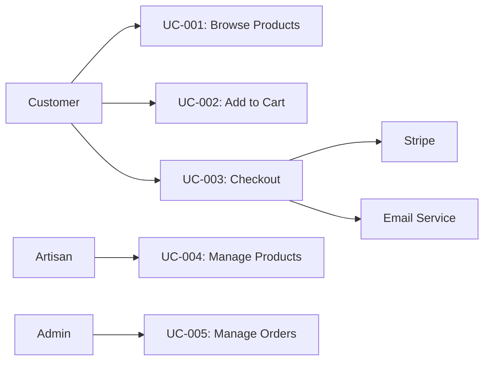

# ShopWave - Use Case Diagram

## Metadata
- **Version**: 1.0
- **Author**: Casey Park (Business Analyst)
- **Date**: 2026-01-15
- **Project**: ShopWave

## System Overview

**System Name**: ShopWave
**Description**: E-commerce platform for handcrafted home goods

## Actors

### Primary Actors

| Actor ID | Actor Name | Description |
|----------|-----------|-------------|
| A1 | Customer | Unauthenticated or authenticated buyer |
| A2 | Artisan | Seller managing products |
| A3 | Admin | Platform administrator |

### Secondary Actors

| Actor ID | Actor Name | Description |
|----------|-----------|-------------|
| A4 | Stripe | Payment processing service |
| A5 | Email Service | SendGrid email delivery |
| A6 | Shipping API | USPS/FedEx shipping labels |

## Use Cases

### UC-001: Browse Products

**Actor**: Customer (A1)
**Description**: Customer views product catalog

**Preconditions**:
- Products exist in catalog
- Customer is on homepage or products page

**Postconditions**:
- Customer sees product listings

**Basic Flow**:
1. Customer navigates to products page
2. System retrieves product list
3. System displays products with images, names, prices
4. Customer can filter/search products
5. Customer clicks on product
6. System displays product details

**Alternative Flows**:
- A1: No products found - System displays "No products available"
- A2: Search returns no results - System displays "No results found"

**Exception Flows**:
- E1: Database error - System displays error message

**Priority**: High
**Complexity**: Low

---

### UC-002: Add to Cart

**Actor**: Customer (A1)
**Description**: Customer adds product to shopping cart

**Preconditions**:
- Product exists and is in stock
- Customer is on product page

**Postconditions**:
- Product is added to cart
- Cart count is updated

**Basic Flow**:
1. Customer views product details
2. Customer clicks "Add to Cart"
3. System validates product availability
4. System adds product to cart
5. System updates cart count
6. System displays confirmation

**Alternative Flows**:
- A1: Product out of stock - System displays "Out of stock" message

**Priority**: High
**Complexity**: Medium

---

### UC-003: Checkout

**Actor**: Customer (A1), Stripe (A4)
**Description**: Customer completes purchase

**Preconditions**:
- Customer has items in cart
- Customer is on checkout page

**Postconditions**:
- Order is created
- Payment is processed
- Confirmation email is sent

**Basic Flow**:
1. Customer navigates to checkout
2. Customer reviews cart items
3. Customer enters shipping address
4. Customer enters payment information
5. Customer clicks "Place Order"
6. System validates inventory
7. System processes payment via Stripe (A4)
8. System creates order
9. System sends confirmation email via Email Service (A5)
10. System redirects to order confirmation

**Alternative Flows**:
- A1: Payment declined - System displays error, customer can retry
- A2: Insufficient inventory - System displays error

**Exception Flows**:
- E1: Payment gateway timeout - System displays error, order may be pending

**Priority**: High
**Complexity**: High

---

### UC-004: Manage Products

**Actor**: Artisan (A2)
**Description**: Artisan manages their product listings

**Preconditions**:
- Artisan is authenticated
- Artisan has products

**Postconditions**:
- Products are created/updated/deleted

**Basic Flow**:
1. Artisan logs in
2. Artisan navigates to product management
3. Artisan can:
   - Create new product
   - Edit existing product
   - Delete product
   - View product performance

**Priority**: Medium
**Complexity**: Medium

---

### UC-005: Manage Orders

**Actor**: Admin (A3)
**Description**: Admin manages all orders

**Preconditions**:
- Admin is authenticated
- Orders exist in system

**Postconditions**:
- Orders are updated and fulfilled

**Basic Flow**:
1. Admin logs in
2. Admin navigates to order management
3. Admin can:
   - View all orders
   - Update order status
   - Process refunds
   - Generate reports

**Priority**: Medium
**Complexity**: High

---

## Use Case Diagram

## Approval

- [ ] Casey Park (Business Analyst)
- [ ] Alex Rivera (Product Owner)
- [ ] Jordan Smith (Tech Lead)
